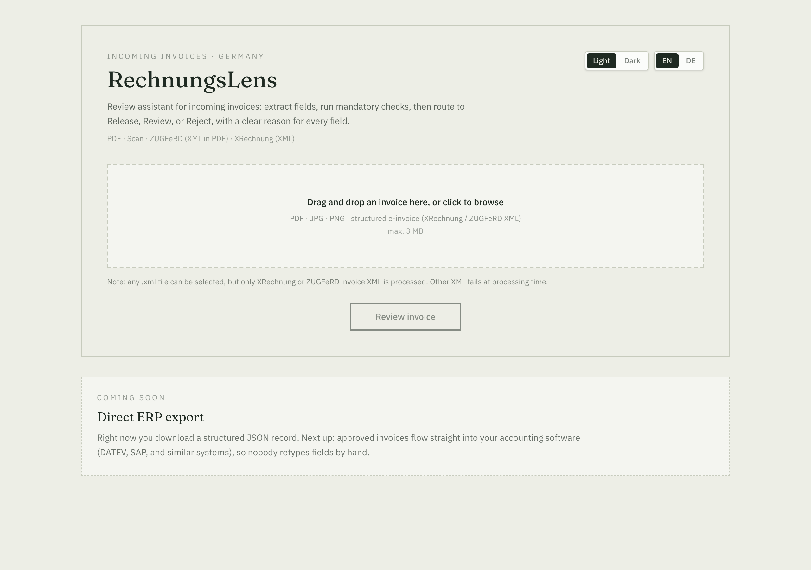
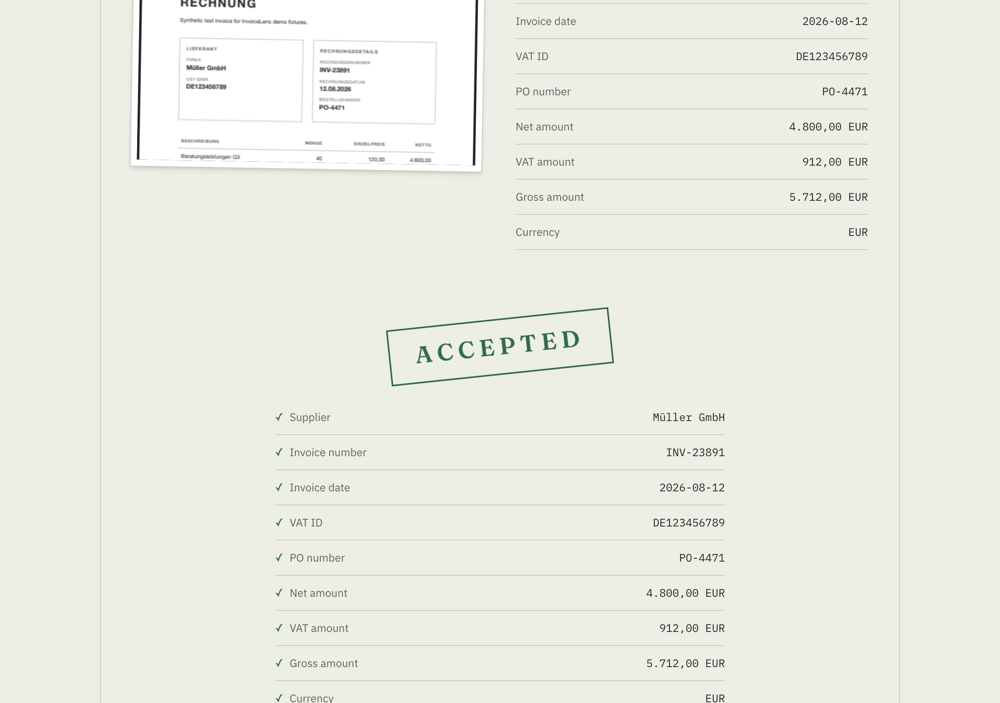
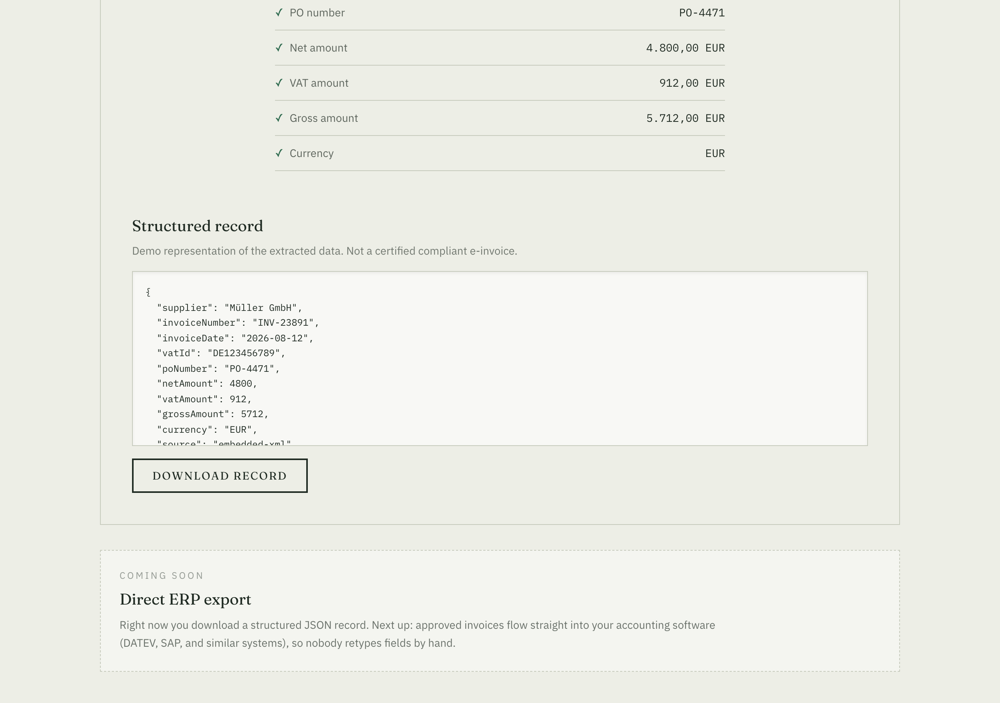

# RechnungsLens

**Incoming-invoice review for the German market.** Upload, extract, validate, route.

Upload a PDF, scan, photo, or structured e-invoice (XRechnung / ZUGFeRD). The app extracts fields with confidence scores, runs deterministic checks, and routes to **Release**, **Review**, or **Reject** with a reason per field.

Since January 2025, German businesses must be able to receive structured electronic invoices (*E-Rechnung*). In practice, AP teams still get PDFs, scans, and the occasional proper XML file. RechnungsLens focuses on the receiving side: understand what came in, flag problems, explain the decision.

> Student project · synthetic test data only · not production software or tax advice.

## Pipeline

```
       Invoice (PDF / scan / photo / XML)
                  │
     ZUGFeRD or XRechnung with embedded XML?
          │                    │
         Yes                   No
          │                    │
   Parse XML directly    Gemini extraction
   (no AI, 100% conf.)  (per-field confidence)
          │                    │
          └────────┬───────────┘
                    ▼
          Deterministic validation
   (required fields · DE VAT format · net+VAT=gross · PO warning)
                    │
                    ▼
         Release · Review · Reject
```

Structured XML is read directly when present. No Gemini call. Everything else goes through Gemini with per-field confidence. Validation applies the same rules either way.

## Features

- Drag-and-drop upload (PDF, JPG, PNG, XRechnung / ZUGFeRD XML)
- Inline preview before processing
- ZUGFeRD / XRechnung fast path (embedded XML, no AI)
- Gemini extraction for scans and plain PDFs
- Validation: required fields, `DE` + 9-digit VAT format, math check (±€0.01), PO warning, confidence threshold at 70
- Ledger-style results UI with JSON export
- English / German UI toggle (defaults from browser language)
- ERP export roadmap (DATEV, SAP, and similar systems)

## Tech stack

| Layer | Choice |
|-------|--------|
| App | Next.js 16 · App Router · TypeScript · Tailwind CSS v4 |
| AI extraction | Google Gemini API (`@google/genai`) |
| XML / PDF | `fast-xml-parser` · `pdf-lib` (ZUGFeRD attachments) |
| Upload | `react-dropzone` (3 MB cap; keeps base64 payloads under Vercel's 4.5 MB limit) |

Stateless: upload → process → show result. No database.

**Live demo:** [rechnungs-lens-tawny.vercel.app](https://rechnungs-lens-tawny.vercel.app)

## Screenshots

Upload and review flow on the [live demo](https://rechnungs-lens-tawny.vercel.app) (ZUGFeRD fixture, no AI call):

| Upload | Release decision |
|--------|------------------|
|  |  |

Structured JSON export is available today. **Direct ERP export** (DATEV, SAP, and similar accounting systems) is on the roadmap so approved invoices no longer get retyped by hand.



## Roadmap

- **Now:** explainable extraction, deterministic validation, Release / Review / Reject routing, JSON download
- **Coming soon:** post approved invoices straight into company ERP / accounting software (DATEV, SAP, and comparable systems)

## Quick start

**Requirements:** Node.js 20+ (24 LTS recommended), npm

```bash
git clone https://github.com/AliyanRizwanDev/RechnungsLens.git
cd RechnungsLens
npm install
cp .env.example .env.local   # add your Gemini key
npm run dev
```

Open [http://localhost:3000](http://localhost:3000).

```bash
# .env.local: never commit
GEMINI_API_KEY=your_key_here
```

Free key from [Google AI Studio](https://aistudio.google.com/apikey). ZUGFeRD files work without a key; scans and plain PDFs need Gemini.

## Scripts

| Command | Purpose |
|---------|---------|
| `npm run dev` | Local dev server |
| `npm run build` | Production build |
| `npm run test` | Vitest (validation rules) |
| `npm run lint` | ESLint |
| `npm run generate:fixtures` | Regenerate synthetic invoice PDFs/images |
| `npm run verify:fixtures` | Offline fixture checks (no API key) |
| `npm run verify:fixtures:live` | Full pipeline via `/api/extract` |

## Test fixtures

Seven files in `fixtures/test-invoices/`, each with a known expected decision:

| File | Expected decision |
|------|-------------------|
| `clean.pdf` | Release |
| `math-error.pdf` | Reject (net + VAT ≠ gross) |
| `missing-vat-id.pdf` | Reject |
| `malformed-vat-format.pdf` | Review (VAT format) |
| `zugferd-compliant.pdf` | Release via embedded XML (no AI) |
| `sample-zugferd.xml` | Release via standalone XML upload (no AI) |
| `messy-scan.jpg` | Review (low confidence / missing PO) |

Details: [fixtures/test-invoices/README.md](fixtures/test-invoices/README.md)

## Project layout

```
├── app/api/extract/     # POST → extract + validate
├── components/          # Upload, results, i18n
├── lib/                 # zugferd, gemini, validate, i18n
├── fixtures/test-invoices/
└── scripts/             # generate + verify fixtures
```

## What this is not

Not production AP software, not legal or tax advice, and not a tool that generates compliant outgoing XRechnung. It demonstrates explainable ingestion and validation on synthetic data.

---

Built by [Mohammad Aliyan](https://github.com/AliyanRizwanDev)
